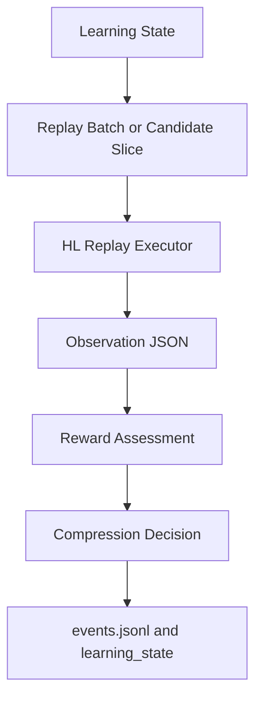

# HL Replay Executor

The HL replay executor is the lightweight execution layer for the role-eval
heuristic learning loop. It is not a Promptfoo replacement in general. It only
does the minimum work needed to turn replay batches or candidate slices into
structured observations for reward assessment.

## Position In The Loop



Promptfoo test generation remains the main path for project datasets. The HL
replay executor is a smaller optional path for cases where a focused replay only
needs structured observations for the heuristic system.

## Replay Config

Replay configs live under:

```text
role_eval/testsets/replay/configs/*.yaml
```

Minimal shape:

```yaml
version: v1
run_id: hl_pilot_dry_run
input_path: role_eval/testsets/experiments/hl_pilot/conversation_core_candidate_slice.v1.json
output_path: role_eval/testsets/replay/outputs/hl_pilot_dry_run.observations.json
context_path: role_eval/testsets/replay/contexts/tapdoki_slowpoke_core.yaml
provider:
  type: openai_compatible
  model: MiniMax-M2.7-highspeed
  base_url_env: OPENAI_BASE_URL
  api_key_env: OPENAI_API_KEY
  temperature: 0.1
  max_tokens: 1024
judge:
  enabled: false
```

Provider secrets must come from environment variables. Do not put API keys in
replay configs.

## Context Config

Context configs live under:

```text
role_eval/testsets/replay/contexts/*.yaml
```

Minimal shape:

```yaml
version: v1
variables:
  series_core:
    file: tapdoki/series_core.md
record_context:
  character_context_field: character_context
prompt:
  system_template: |
    {{series_core}}

    {{character_context}}
  user_template: |
    {{input}}
```

Variables with `file` are loaded from disk. `character_context` can come from a
record field containing a `file://` path; the executor resolves and loads that
file when possible.

## Observation Output

Observation files live under:

```text
role_eval/testsets/replay/outputs/*.observations.json
```

Minimal shape:

```json
{
  "version": "v1",
  "run_id": "hl_pilot_dry_run",
  "input_path": "role_eval/testsets/experiments/hl_pilot/conversation_core_candidate_slice.v1.json",
  "context_path": "role_eval/testsets/replay/contexts/tapdoki_slowpoke_core.yaml",
  "dry_run": true,
  "records": [
    {
      "record_id": "conversation_core_candidate_001",
      "source_record_id": "source_001",
      "input": "Say one small sentence I can tell myself.",
      "output": "[DRY RUN]",
      "judge": {
        "enabled": false
      },
      "metadata": {
        "role": "slowpoke",
        "project": "slowpoke",
        "generic_dimension": "lightweight_practical_help"
      },
      "failure_tags": []
    }
  ]
}
```

Observations are evidence inputs. They do not change canonical status and do not
decide compression by themselves.
